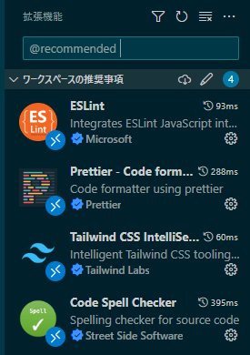

# react-tailwindcss-template

## Overview

Template with React + TailWindCSS

Installed the prettier, eslint and huscky.

## How to Install Library

- [TailWindCSS](https://tailwindcss.com/docs/guides/vite)
- [husky](https://zenn.dev/okaharuna/articles/aa715f2d9c1929#husky)

## Plugins of visual studio code

### Plugins which are required

- [Tailwind CSS IntelliSense](https://marketplace.visualstudio.com/items?itemName=bradlc.vscode-tailwindcss)
- [Prettier - Code formatter](https://marketplace.visualstudio.com/items?itemName=esbenp.prettier-vscode)
- [ESLint](https://marketplace.visualstudio.com/items?itemName=dbaeumer.vscode-eslint)

### Plugins which are recommended

- [Code Spell Checker](https://marketplace.visualstudio.com/items?itemName=streetsidesoftware.code-spell-checker)

You search with `@recommend` on visual studio code extensions search input.

You can find the recommended plugins.

